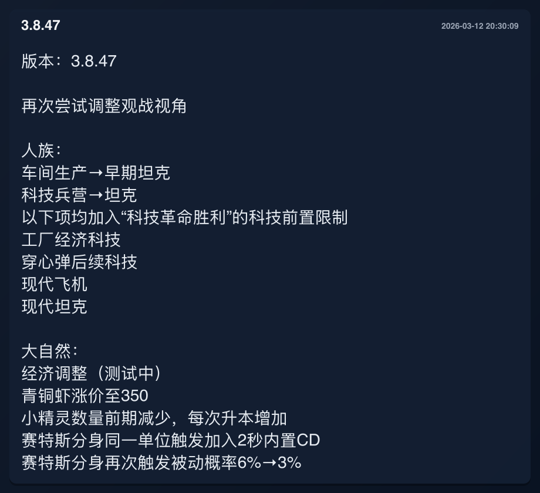
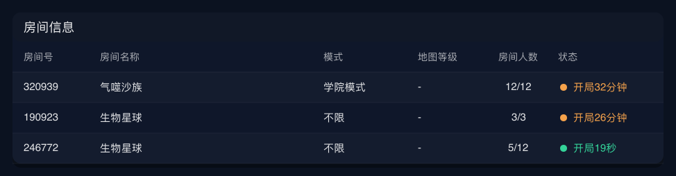

# KK对战平台 群聊机器人（NapCat + OneBot + Canvas）

按功能分层的 Node.js 项目结构：
- `config`：环境变量与校验
- `integrations`：KK HTTP 请求封装
- `bot`：NapCat WS 连接与消息路由
- `features`：房间信息、更新信息的业务与绘图
- `app`：应用装配与启动

## 前置条件（必须先完成）

- 必须先部署 NapCat（推荐）或其他支持 OneBot WebSocket 的服务。
- 若未提供 OneBot WebSocket 服务，本项目将无法接收群消息，也无法回发图片。
- 请先确认机器人账号在线，并且已加入目标 QQ 群。

## 0. 项目用途

这个项目主要用于让群友在 QQ 群里直接查看 KK 平台地图房间信息和地图更新信息。  
不用每次都开电脑进入平台页面，也能快速知道当前有哪些房间、是否开局、最近更新了什么内容。

支持这些群命令：
- `房间信息`：查询房间列表（空参数走默认 mapId；有参数全部按房间名搜索）
- `房间信息80`：查询 80dz 房间列表（需要配置 80dz 账号密码）
- `更新信息`：查询地图最新更新日志（对应当前群 mapId）

错误处理：
- 接口请求失败会回发一张“请求失败”提示图（包含错误信息与“请联系bot管理员”）。
- 不再在群里发送 `生成失败：...` 文本。

## 1. 运行预览

更新信息示例：



房间信息示例：



## 2. 环境要求

- Node.js >= 18
- 可用的 NapCat/OneBot WebSocket 服务

安装依赖：

```bash
npm i ws canvas
```

## 3. 目录结构

```text
.
├── docs
│   └── images
│       ├── preview-changelog.png # README 运行预览图（更新信息）
│       └── preview-room-info.png # README 运行预览图（房间信息）
├── kkbot.js                     # 兼容入口（内部调用 ./src）
├── README.md
└── src
    ├── app.js                   # 应用装配（把 bot + features 连接起来）
    ├── index.js                 # src 入口导出
    ├── config
    │   └── index.js             # 环境变量解析与配置校验
    ├── integrations
    │   └── kk-api.js            # KK 接口请求封装
    ├── bot
    │   └── napcat-group-bot.js  # OneBot WS 连接、重连、命令路由
    └── features
        ├── room-info
        │   ├── service.js       # 房间查询路由 + 数据转换
        │   └── renderer.js      # 房间表格绘图
        └── changelog
            ├── service.js       # 更新日志查询 + HTML 转文本
            └── renderer.js      # 更新日志卡片绘图
```

## 4. 环境变量

可以复制 `.env.example` 生成 `.env` 后按需配置：

```bash
cp .env.example .env
```

程序会自动读取当前工作目录下的 `.env`（系统环境变量优先级更高）。

必填：
- `KK_TOKEN`

可选启用：
- `DZ80_USERNAME` 和 `DZ80_PASSWORD`：同时配置后启用 `房间信息80` 查询。只配置其中一个不会启用 80dz 功能。

### KK_TOKEN 获取方式

方式一（网页控制台）：
1. 登录 [KK 平台](https://www.kkdzpt.com/) 账号。
2. 打开浏览器开发者工具（F12）控制台执行：

```js
JSON.parse(sessionStorage.getItem('user-global')).user.token;
```

说明：这种 token 通常有效期较短（一般约 1 天，实际以平台策略为准）。

方式二（小程序网络抓包）：
1. 对微信 KK 平台小程序抓包获取 token。
2. 这种 token 有效期通常更长（一般约 30 天，实际以平台策略为准）。

说明：实际有效期以平台策略为准，建议过期后及时更新。使用时请遵守平台规则与相关法律法规。

常用：
- `NAPCAT_WS_URL`：默认 `ws://127.0.0.1:3001/`
- `NAPCAT_TOKEN`：NapCat token（可选）
- `GROUP_IDS`：逗号分隔群号，例如 `123456789,987654321`
- `ROOM_INFO_TRIGGER_TEXT`：房间信息触发词，默认 `房间信息`
- `CHANGELOG_TRIGGER_TEXT`：更新信息触发词，默认 `更新信息`
- `COOLDOWN_MS`：每群每命令冷却毫秒，默认 `5000`
- `FETCH_TIMEOUT_MS`：接口请求超时毫秒，默认 `10000`
- `WS_RECONNECT_DELAY_MS`：WS 重连间隔毫秒，默认 `3000`

KK 相关：
- `KK_ROOMS_ENDPOINT`：房间接口基础地址
- `KK_CHANGELOGS_ENDPOINT`：更新日志接口地址
- `KK_DEFAULT_MAP_ID`：全局默认 mapId
- `GROUP_DEFAULT_MAP_IDS`：分群默认 mapId，格式 `群号:mapId;群号:mapId`
- `KK_MAP_LIST_LIMIT`：按 mapId 查询房间时的 limit（默认 `32`）
- `KK_ROOM_NAME_LIST_LIMIT`：按 roomName 查询房间时的 limit（默认 `12`）
- `KK_CHANGELOG_LIMIT`：更新日志查询条数（默认 `1`）

80dz 相关：
- `ROOM_INFO_80_TRIGGER_TEXT`：80dz 房间查询触发词，默认 `房间信息80`
- `DZ80_USERNAME`：80dz 登录账号/手机号
- `DZ80_PASSWORD`：80dz 登录密码
- `DZ80_SESSION_CACHE_FILE`：sid 缓存文件，默认 `./logs/80dz-session.json`
- `DZ80_ROOMS_ENDPOINT`：80dz 房间接口，默认 `https://sala.80dzgame.com/hall/getTeamPageInfo`
- `DZ80_LOGIN_ENDPOINT`：80dz 登录接口，默认 `https://apionline.80dzgame.com/user/pwdLogin`
- `DZ80_CLIENT_VERSION`：80dz 客户端版本，默认 `1.9.9.50`
- `DZ80_CHANNEL`：80dz 渠道，默认 `biying`
- `DZ80_COUNTRY_CODE`：国家区号，默认 `86`
- `DZ80_ROOM_LIST_SIZE`：80dz 每次查询数量，默认 `12`

80dz 兼容项：
- `WAR3_USERNAME`、`WAR3_PASSWORD`、`WAR3_SID` 可作为 fallback；新配置建议统一使用 `DZ80_*`。
- sid 缓存文件只保存 `sid/token/uid/user_info/savedAt`，不会保存明文密码。

渲染相关：
- `MAX_ROWS`：房间表格最多展示行数，默认 `18`
- `CANVAS_WIDTH`：房间表格画布宽度，默认 `974`
- `CHANGELOG_CANVAS_WIDTH`：更新日志画布宽度，默认 `920`
- `ERROR_CANVAS_WIDTH`：错误提示图宽度，默认 `860`

日志相关：
- `LOG_DIR`：日志目录，默认 `./logs`
- `LOG_FILE`：日志文件名，默认 `kkbot.log`

兼容项：
- `TRIGGER_TEXT`：等同 `ROOM_INFO_TRIGGER_TEXT`
- `ROOMS_URL`：旧版兼容变量，会自动取 endpoint 基础路径

## 5. 命令用法

- `房间信息`
  - 优先使用该群在 `GROUP_DEFAULT_MAP_IDS` 的默认 mapId
  - 未配置则回退到 `KK_DEFAULT_MAP_ID`
- `房间信息 生物星球`
  - 直接按 `roomName=生物星球` 搜索
- `房间信息 12860`
  - 也按 `roomName=12860` 搜索（不会再按 mapId 查询）

- `房间信息80`
  - 查询 80dz 默认房间列表（`room_name=""`）
- `房间信息80 生物星球`
  - 查询 80dz，直接把 `生物星球` 作为 `room_name`

- `更新信息`
  - 按当前群默认 mapId 查询最新更新日志
- `更新信息 xxx`
  - 参数会被忽略，仍只按当前群默认 mapId 查询

### 80dz 自动登录与 sid 缓存

启用 80dz 后，机器人会优先使用内存中的 sid；进程刚启动且内存为空时，会读取 `DZ80_SESSION_CACHE_FILE`。如果房间接口返回 `code:0`，说明 sid 有效，会继续复用。

如果房间接口返回：

```json
{"code":6,"data":{"total":0}}
```

说明 sid 已过期。机器人会自动用 `DZ80_USERNAME` / `DZ80_PASSWORD` 调用登录接口获取新的 `hs_token`，把它作为新的 sid 缓存到本地，然后重试本次房间查询一次。重试仍失败时，会回发错误图片。

80dz 房间图字段映射：

| 图片列 | 80dz 字段 | 说明 |
|---|---|---|
| 房间号 | `room_code` | 直接显示 |
| 房间名称 | `name` | 有密码时名称后显示锁 |
| 地图名称 | `map_name` | 自动清理 Warcraft 颜色码 |
| 密码 | `room_password` | 空字符串显示 `-` |
| 房间人数 | `players` | 例如 `1/6` |
| 状态 | `status` | `0` 显示 `等待中`，`1` 显示 `已开始` |

## 6. 启动

```bash
npm start
```

## 7. 常见维护点

### 改默认群号
修改 `src/config/index.js` 里的 `DEFAULT_GROUP_IDS`。

### 改命令触发
修改环境变量 `ROOM_INFO_TRIGGER_TEXT`、`CHANGELOG_TRIGGER_TEXT`。

### 改排序逻辑
修改 `src/features/room-info/service.js` 的 `toTableModel()` 排序部分。

### 改房间图样式
修改 `src/features/room-info/renderer.js`。

### 改更新日志图样式
修改 `src/features/changelog/renderer.js`。

### 改消息路由/频控
修改 `src/bot/napcat-group-bot.js`。

## 8. 发布到 GitHub 前

- 不要提交 `.env`（已在 `.gitignore` 忽略）。
- 不要提交 `logs/`、`node_modules/`、`.npm-cache/`（已忽略）。
- 提交前建议先跑：

```bash
npm run check
```

首次上传（本地已 `git init`）：

```bash
git add .
git commit -m "feat: initial kkbot setup"
git branch -M main
git remote add origin <你的仓库地址>
git push -u origin main
```

## 9. 说明

- `kkbot.js` 作为兼容入口保留，便于继续沿用原启动命令。
- 生产环境建议使用进程守护工具（如 pm2/systemd）运行。

## 10. 开源协议

本项目采用 MIT License，详见 [LICENSE](LICENSE)。
